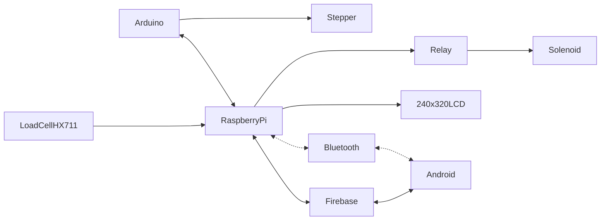

# Brief CENG Capstone Project Charter
-  [x] Select Project area:
1. [ ] :bike: Facilities: e.g. Bicycle Rental/Parking Lot/Vision System
2. [ ] :factory: Building Automation: e.g. Greenhouse/SolarPanel/Home
3. [ ] :movie_camera: Consumer: e.g. Entertainment Protocol DMX/Baby Monitoring Project
4. [ ] :mortar_board: Education: e.g. Robust Hackable Educational Project
5. [ ] :robot: Robotics: e.g. Control/Navigation/Dashboard
6. [ ] :ski: Health and Wellness: e.g. Wearable
####  Project Title: 
Replace this with your title

####  Executive Summary/Description of the Project (75 to 100 words): 
Write here

####  Has this project been approved by all parties for posting (Y/N)?
-  [x] Yes
-  [ ] No

Optional Collaborator fields for sponsored projects

#### Sponsoring Industry and Personnel: 
#### Hours contributed: 
#### Number of full-time employees, year established, private or not-for-profit: 
#### Value of equipment or access to equipment provided: 
#### FAST contribution: 

####  List of Names of Students Involved in Project (first and last names and separate members by a comma):
First Last, One Two

####  Planned contact email for the [Expo submission form](https://appliedtechnology.humber.ca/shows/past-shows/advanced-manufacturing-projects/advanced-manufacturing-student-submission-form.html)
example_at_example_dot_com

####  For each individual student state whether they have a complete parts kit, a multimeter, what development platform they have, what sensors/effectors they have along with system Requirements (List what sensors/effectors are to do), functionalty of prototype/describe any unsoldered connections.
Student One:
- [ ] Complete parts kit
- [ ] Multimeter
- Development platform: Broadcom single board computer
- Sensor/effector 1:
- Unsoldered connection description:   

Student Two:
- [ ] Complete parts kit
- [ ] Multimeter
- Development platform: Broadcom single board computer
- Sensor/effector 2:
- Unsoldered connection description:   

Student Three:
- [ ] Complete parts kit
- [ ] Multimeter
- Development platform: Broadcom single board computer
- Sensor/effector 3:
- Unsoldered connection description:   

Student Four:
- [ ] Complete parts kit
- [ ] Multimeter
- Development platform: Broadcom single board computer
- Sensor/effector 4:
- Unsoldered connection description:   

####  GitHub repository link(s):
[Example link - ezpark](https://github.com/AkashSingh8137/ezpark)

####  Google Play App download link:
[Example link - EZPARK](https://play.google.com/store/apps/details?id=ca.ezlock.it.ezpark&pli=1)

#### Hours per student:
$14\*3=42$ in class hours, $14\*3=42+$ outside of class.

#### Supervising Faculty: 
Kris Medri   
Meirion Williams

####  Hours per faculty: 
$14\frac{3}{20}\*3=6.3$ in class, $14\frac{1.05+1.49}{20}\*3=5.334+$ outside of class.

####  Scope:
Creation of a Prototype that is not to be left powered unattended. Keeping safety and Z462 in mind, the highest AC voltage that is to be used is 16Vrms from a wall adapter from which +/- 15V or as high as 45 VDC can be obtained. Maximum power consumption is to be 20 Watts. In alignment with the space below the tray in the Humber North Campus Electronics Parts kit the overall project maximum dimensions are 12 13/16" x 5 ¹/₂" x 2 ³/₄" = 32.5cm x 14cm x 7cm. If your PCB doesn’t work or you need to switch sensors/effectors, it is recommended that you use the SparkFun Qwiic system: https://www.sparkfun.com/products/15945

####  Design approach:

####  Mandate: 
Self funded (unless a sponsor has contractually agreed to contribute).
